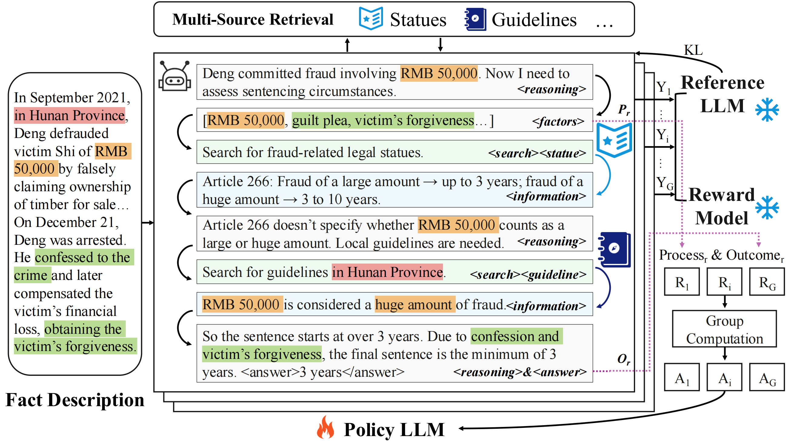

# Multi-Source Retrieval and Reasoning for Legal Sentencing Prediction



Legal judgment prediction (LJP) aims to predict judicial outcomes from case facts and typically includes law article, charge, and sentencing prediction. While recent methods perform well on the first two subtasks, legal sentencing prediction (LSP) remains difficult due to its need for fine-grained objective knowledge and flexible subjective reasoning. To address these limitations, we propose $MSR^2$, a framework that integrates multi-source retrieval and reasoning in LLMs with reinforcement learning. $MSR^2$ enables LLMs to perform multi-source retrieval based on reasoning needs and applies a process-level reward to guide intermediate subjective reasoning steps. Experiments on two real-world datasets show that $MSR^2$ improves both accuracy and interpretability in LSP, providing a promising step toward practical legal AI.

## Links

- [Multi-Source Retrieval and Reasoning for Legal Sentencing Prediction](#multi-source-retrieval-and-reasoning-for-legal-sentencing-prediction)
  - [Links](#links)
  - [Environment](#environment)
  - [Quick start](#quick-start)
  - [Evaluate](#evaluate)
  - [Use your own dataset](#use-your-own-dataset)
    - [QA data](#qa-data)
  - [Features](#features)
  - [Acknowledge](#acknowledge)

## Environment

```bash
conda create -n msr python=3.10
conda activate msr
# install torch [or you can skip this step and let vllm to install the correct version for you]
# install torch
pip install torch==2.6.0 torchvision==0.21.0 torchaudio==2.6.0 --index-url https://download.pytorch.org/whl/cu124
# install vllm
pip3 install vllm==0.8.4 

# verl
pip install -e .

pip3 install flash-attn --no-build-isolation

pip install swanlab
pip install wandb
```
> 配置环境 tips: 
> 1. flash-attn 手动安装适配版本，配套cuda与torch；例如：pip install flash_attn-2.7.1.post2+cu12torch2.4cxx11abiFALSE-cp310-cp310-linux_x86_64.whl
> 2. opentelemetry 等需要适配 vllm 和 torch 版本
> 3. ray 推荐版本 2.48.0
> 4. langchain、langchain_community 推荐版本 0.3.27

## Quick start

Train a reasoning + search LLM on Legal Judgment Prediction dataset.


(1) Run RL training (PPO) with Qwen3-8b.
```bash
conda activate msr
bash train_grpo.sh
```

## Evaluate

(1) get inference result
```bash
conda activate msr
./get-eval.sh
```

(2) get evaluation result
```bash
conda activate msr
./exp.sh
```
## Use your own dataset

### QA data
For each question-answer sample, it should be a dictionary containing the desired content as below:

```
data = {
        "data_source": data_source,
        "prompt": [{
            "role": "user",
            "content": question,
        }],
        "ability": "fact-reasoning",
        "reward_model": {
            "style": "rule",
            "ground_truth": solution
        },
        "extra_info": {
            'split': split,
            'index': idx,
        }
    }
```
You can refer to ```/examples/data_preprocess/process_train_val_data.py``` for a concrete data processing example.

## Features
- Support different RL methods (e.g., PPO, GRPO). ✔️
- Support different LLMs (e.g. Qwen2.5, Qwen3, etc). ✔️

## Acknowledge

The concept of $MSR^2$ is inspired by [Search-R1](https://github.com/PeterGriffinJin/Search-R1)、[Deepseek-R1](https://github.com/deepseek-ai/DeepSeek-R1)、[code-r1](https://github.com/wyf3/llm_related/tree/main/code-r1) and [TinyZero](https://github.com/Jiayi-Pan/TinyZero/tree/main).
Its implementation is built upon [veRL](https://github.com/volcengine/verl) and [RAGEN](https://github.com/ZihanWang314/RAGEN/tree/main). 
We sincerely appreciate the efforts of these teams for their contributions to open-source research and development.
